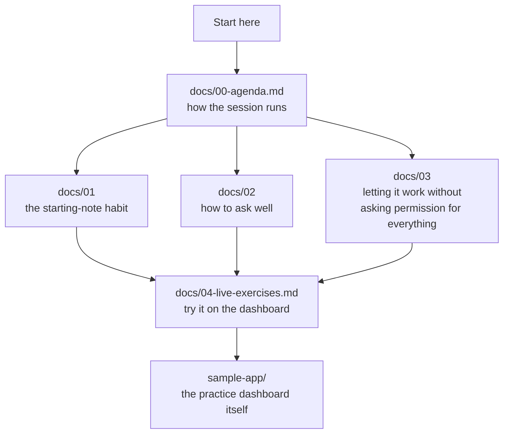

# playground-claude-code

A hands-on collection of material for a session on working well with an AI
assistant — made to be opened and tried, not just read.

## What's in here



- **The practice dashboard** (`sample-app/`) — a small page of charts and
  numbers, built just for trying things out on. It has a few things
  wrong with it on purpose — see the exercises page below.
- **The session pages** (`docs/`) — read in order, or jump to whichever
  one you need:
  - `00-agenda.md` — how the session is meant to run
  - `01-claude-md-best-practices.md` — the habit of leaving a short note
    before work begins, and what actually belongs in it
  - `02-prompting-patterns.md` — the difference a well-asked question
    makes
  - `03-tools-permissions-hooks.md` — letting the boring, safe stuff
    happen without asking, while still keeping an eye on anything that
    matters
  - `04-live-exercises.md` — three things to fix on the practice
    dashboard, each one practicing a different habit

## Getting started

Just open the practice dashboard in a browser:

```
open sample-app/index.html
```

Then read `docs/00-agenda.md` if you're running the session for a group,
or skip straight to `docs/04-live-exercises.md` if you're here to try
things out yourself.
