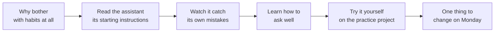

# How today will go

This isn't a lecture. It's a short walk through a handful of habits that
make working with an AI assistant smoother — followed by time to actually
try them, on a small practice project built just for this.

## The six parts

1. **Why this matters (5 minutes).** Not "how to write code" — how to work
   *with* something that can write code for you. The practice project is
   just the thing we point at; the habits are the actual point.

2. **The starting instructions (10 minutes).** Every project can have a
   short note that tells the assistant what it needs to know before it
   starts — not a manual, just the handful of things it couldn't guess on
   its own. We'll read the one written for this project together, and
   talk about why it's short on purpose.

3. **Watching it check itself (10 minutes).** You can set up small,
   automatic checks that run quietly whenever a change is made — a bit
   like a spell-checker that runs itself. We'll make a change live and
   watch one of these checks catch something.

4. **Asking well (15 minutes).** The single biggest difference between a
   frustrating session and a smooth one is *how* you ask. We'll try the
   same request two ways — vague, then specific — and look at what comes
   back each time.

5. **Hands-on practice (20-30 minutes).** A small dashboard (think: a page
   full of charts and numbers) has three things wrong with it, each one
   picked to practice a different habit. Pair up if the room is big.

6. **Wrap-up (5 minutes).** One question: what's the one thing from today
   you'll actually do differently next week? That's the only part that
   has to stick.

## If you only have twenty minutes

Do part 3 (watching the automatic check happen) and the first hands-on
exercise in `04-live-exercises.md`. That's the fastest route to "oh, that's
actually useful" — which is the whole goal of a short session.
