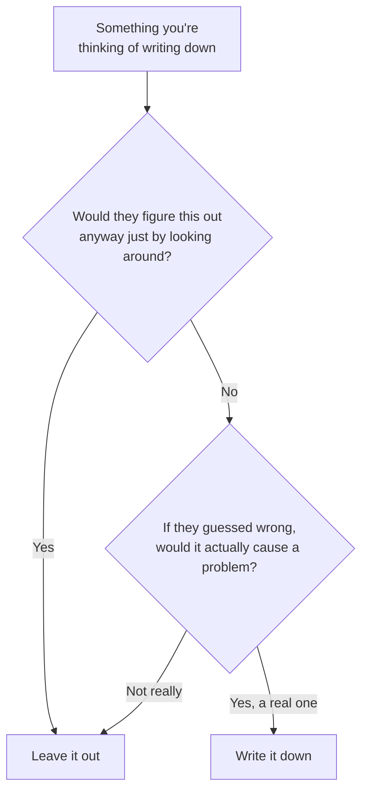

# The note you leave before you start

Imagine hiring someone brilliant and capable, who's never seen your
project before, and who reads a short note from you before touching
anything. What would you actually bother writing in that note?

Not the obvious stuff, they'll figure out what the folders are called by
looking. You'd write down the things they'd genuinely get wrong by
guessing: the one convention that looks arbitrary unless you know why, the
command that isn't the obvious one, the thing that would cause real
trouble if assumed instead of asked.

That note is what a project's starting-instructions file is. And the habit
worth building is this: **everything in that note gets read every single
time, by everyone, forever**, so every sentence you add has an ongoing
cost. The best version is the shortest one that still prevents real
mistakes.

## A simple way to decide what belongs in the note

Walk through this project's actual note (`CLAUDE.md`, in the main folder)
against that test:

| What it says | Why it earned its place |
|---|---|
| "No installing anything, no setup step" | Saves a wrong guess: the obvious-but-wrong instinct for this kind of file is to go install something first. |
| A note about treating text as plain text, never as instructions | Not something you'd notice from glancing at one file. It's a habit that spans the whole project, and the reason behind it isn't obvious. |
| "A background check already runs automatically" | Stops it from redoing work that's already being done for it. |
| "A few things are broken on purpose. Don't fix them" | Without this line, the very first thing it would do is "helpfully" fix the practice exercises before anyone gets to try them. This one line is doing the most work in the whole file. |

Notice what's missing, too: no explanation of what a chart is, no history
lesson about why one tool was picked over another. All of that is either
obvious from looking, or wouldn't change what happens next. It's simply
not there.

## A quick gut-check

Before adding a sentence, ask: *if I deleted this, what would actually
happen differently, and would that be worse?* If you can't picture a
concrete bad outcome, the sentence isn't earning its place.

## Three ways this goes wrong (watch for these)

- **The diary.** Every decision ever made gets added, nothing is ever
  removed. A year later it's enormous, nobody rereads it, and half of it
  no longer applies, but it's still being followed literally.
- **The pep talk.** Generic advice like "write good code" or "be careful."
  A capable assistant already does this without being told, so it's
  pure cost with nothing gained.
- **The novel.** If explaining something needs headings and sub-sections,
  it's a proper document, not a quick note. Write it separately and just
  point to it.

## Try it yourself

Think of a project you work on. Picture writing that short note for it.
What's the one sentence you'd actually need? Asking yourself whether that
sentence earns its place is the whole skill.
