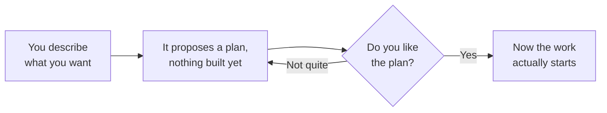
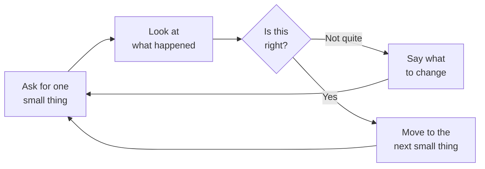

# How you ask changes everything

None of this is a trick. It's the difference between an assistant guessing
at what you meant, and an assistant actually doing what you meant. Try
each one live, on the practice dashboard. The difference is obvious once
you see it side by side.

## 1. Specific beats clever

**Vague:** "make the dashboard better"

**Specific:** "the little box showing error rate turns green when things
get *worse*, not better, it should be the other way around"

The vague version forces a guess at what "better" even means, and it
*will* guess something, just probably not what you pictured. The specific
version names exactly what's wrong and what "fixed" looks like. Try both
out loud and compare what actually happens.

## 2. Describe what "done" looks like, not just what to build

Instead of "add a way to filter the chart," try "add a dropdown above the
charts that, when changed, updates everything below it at once. The
numbers in the table should always match what the chart is showing."
Naming what success looks like (not just the feature itself) cuts out a
lot of back-and-forth guessing.

## 3. Hand over the backstory, not just the instruction

An assistant can look at everything in front of it, but it can't read
your mind about *why* something is the way it is. If there's a reason a
certain thing was left alone on purpose, say so up front, otherwise it
will cheerfully "fix" it the hard way, and you'll have to undo that first.

## 4. Ask for a plan before anything gets built

Whenever there's more than one reasonable way to do something, ask for the
plan first instead of letting it just pick one and run with it. You get to
redirect *before* anything exists, which is far easier than redirecting
after.

## 5. Sometimes ask it to find the problem; sometimes just tell it

For the exercises later, try both framings and compare:

- "Something's wrong with how these little boxes change color. Find it
  and fix it."
- "The little boxes are supposed to turn green when things improve and
  red when they get worse. Right now two of them have that backwards."

The second is usually faster and more reliable, because you've done the
hard part of noticing the problem yourself. The first is a fair test of
how well it can spot something on its own, a genuinely different and
useful skill, just slower. Neither is wrong; know which one you're asking
for.

## 6. Small steps beat one giant request

Don't ask for five changes in one breath when the first one might change
your mind about the other four. One step, a look at the result, then
decide the next step. It feels slower in the moment and ends up faster
overall, because you never end up building four things on top of a wrong
first guess.

## 7. Check for yourself, don't just take its word for it

If it says "this is fixed" or "that works now," that's a claim, not
proof. Actually open the page. Click the thing. Look at it. A background
check can catch some kinds of mistakes automatically. It can't replace
you actually looking at the result.
