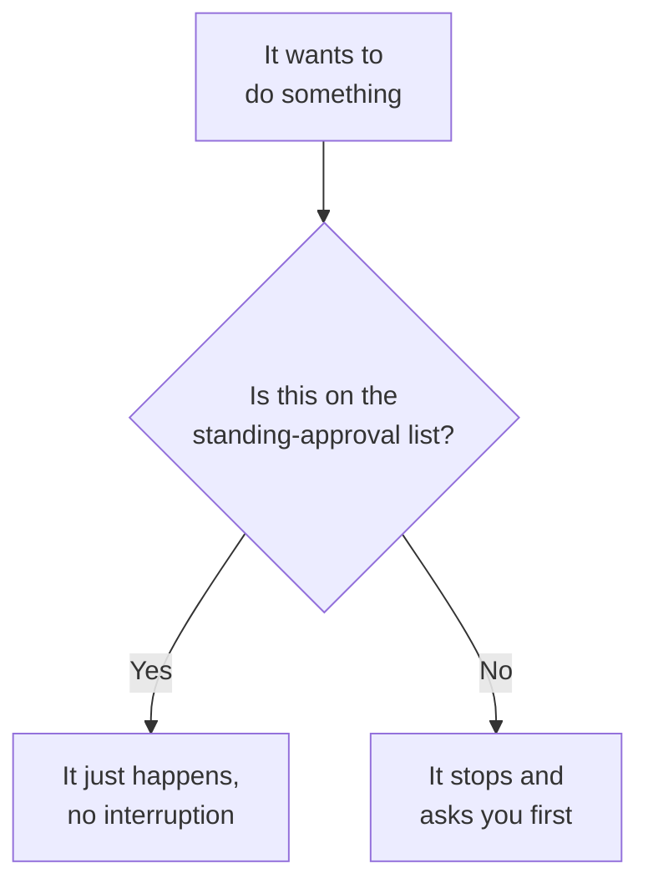

# Letting it work without asking permission for everything

By default, before your assistant does anything (look at a file, change
something, run a command) it stops and asks you first. That's safe, but
if everything requires a yes-click, you spend your whole session clicking
"yes" instead of getting anything done. There's a better way.

## A short list of "don't bother asking"

You can write down a short list of everyday, harmless, repeatable things
it never needs to ask permission for. Think of it as a standing approval
for the boring stuff you'd say yes to every single time anyway. Checking
what changed, looking at what files exist, running the practice project:
none of that needs a conversation.

The habit to build: put the safe, boring, repeatable things on the list.
Leave anything that actually matters (sending something, deleting
something, changing something shared with other people) off the list, so
it keeps asking for those. The goal isn't "never ask me anything," it's
"only interrupt me for things that are actually worth interrupting me
for."

**Try it live:** make a small change to the practice dashboard and notice
you weren't asked anything for the safe parts, but watch what happens the
moment something riskier comes up.

## A background check that runs itself

On top of the standing-approval list, you can set up a small automatic
check that fires every time a particular kind of change happens. It's a
bit like a spell-checker that runs itself the moment you finish typing,
rather than waiting for you to ask for one.

In the practice project, there's one of these set up: every time the
dashboard's logic file gets changed, something quietly double-checks that
the change didn't break anything structurally, before you even get a
chance to look at it yourself.

**Try it live:** make a small typo in the practice file on purpose and
watch the automatic check catch it immediately.

The lesson generalizes: start with one small, fast check. It's tempting to
set up a dozen elaborate checks on day one. Resist that. A single quick
one that actually runs every time beats five thorough ones that are too
slow to bother with.

## Asking for a plan first

Covered in the previous section, but worth repeating here because it's the
single highest-leverage habit: for anything with more than one reasonable
way to do it, ask for a plan before any work begins. You review the plan,
not the finished work, which means redirecting costs you nothing, because
nothing was built yet.

## Quiet helper requests

For a big, open-ended question, something like "what's going on across
this whole project" or "look into three different approaches and report
back," you can hand that off as a quiet side request. It goes off, does the digging,
and comes back with just the answer, instead of filling up your main
conversation with everything it looked at along the way. Not something
you'll need on a project this small, but worth knowing it exists.

## Reusable shortcut phrases

If you find yourself typing a similar multi-sentence request more than a
couple of times, something like "add a new box to the dashboard, following
the usual pattern, make sure it looks right after," you can save that as a
shortcut phrase you type once, instead of writing the whole thing out
every time. This project has one of these set up for adding a new number
box to the dashboard. The rule of thumb: the third time you type something
similar, save it instead.

## Skills versus shortcut phrases

A shortcut phrase is something *you* trigger by name. A skill is a
packaged set of instructions the assistant can also reach for on its own
when the situation matches its description. This project has both:

- `add-metric` is a shortcut phrase (`.claude/commands/add-metric.md`).
  You type it, it runs.
- `grill-me` and `frontend-design` are skills (`.claude/skills/`).
  `grill-me` interviews you about a plan before anything is built.
  `frontend-design` holds the look-and-feel guidance plus this project's
  rules for styling.

Rule of thumb: if it's a fixed recipe you'll call by name, a shortcut
phrase is enough. If it's a way of working that should kick in whenever
the situation fits, make it a skill.
