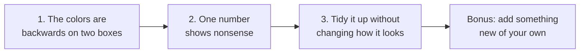

# Try it yourself: the practice dashboard

Open `sample-app/index.html` in a browser before you start — you'll want
to see the dashboard, not just read about it. It has three things wrong
with it, planted on purpose. Each one is a chance to practice a different
habit from the earlier pages. Do them in order — each builds on the last.

## Exercise 1 — the colors are backwards (10 minutes)

**What's wrong:** look at the four number boxes at the top of the
dashboard. Two of them — error rate, and response time — show red even
though they actually *improved*. That's because the dashboard is treating
every box the same way: "went up = good, went down = bad." That's true for
users and revenue, but backwards for error rate and response time, where
going *down* is the improvement.

**Try it two ways** — split into pairs, one pair tries each, then compare:

- Pair A: "Something's off with the colors on the number boxes. Find it
  and fix it."
- Pair B: "Error rate and response time should turn green when they go
  *down*, not up — right now they're using the same up-is-good logic as
  the other boxes. Fix that."

Notice which one gets there faster, and which one you trust more. That's
the tradeoff from the earlier page about asking well.

**How to check it worked:** reload the page. Error rate and response time
should now show green — they both improved in this sample data.

## Exercise 2 — a number breaks (10 minutes)

**What's wrong:** scroll down to the table at the bottom. One row — the
"Social" channel — shows a nonsense value for how much it changed. That's
because there was nothing to compare it against (it didn't exist last
period), and nobody told the dashboard what to do in that situation, so it
does a calculation that doesn't make sense and shows the broken result
plainly.

**Try this:** ask it to find and fix the broken-looking number in the
table, without telling it exactly where the problem is. This is a smaller
version of exercise 1's "find it yourself" approach — a good moment to
notice how much description was actually needed for it to find it quickly.

**Worth discussing as a group:** what *should* that cell show instead?
There isn't one obviously correct answer — "new," a dash, or just hiding
the column for that row are all reasonable. Ask for a plan first and talk
through the options before picking one. That's the "ask for a plan"
habit, applied to a genuinely judgment-call decision.

## Exercise 3 — tidy it up without changing anything visible (15-20 minutes)

**What's wrong:** nothing is actually broken here — this one's about
cleanliness, not correctness. Right now, the part of the dashboard that
figures out each number box's value and decides its color is tangled up
with the part that actually draws it on the screen. Ask for those two
things to be pulled apart, so the "figuring out" part could be checked on
its own, separately from the drawing.

**Why this one matters:** there's more than one reasonable way to untangle
it. Ask for a plan before anything changes, look at the plan, and only
then say go.

**How to check it worked:** the dashboard should look and behave exactly
the same afterward — same colors, same numbers, same everything. If
anything visible changed, that's not a tidy-up, that's a different
change in disguise.

## Bonus, if there's time — add something new

Use the `/add-metric` shortcut phrase mentioned on the earlier page to add
a fifth number box to the dashboard — pick anything you like (how about a
"signups this week" box?). This exercise runs through the whole loop at
once: a clear ask, a quick plan, an automatic background check catching
any mistakes, and a result you can see with your own eyes.
